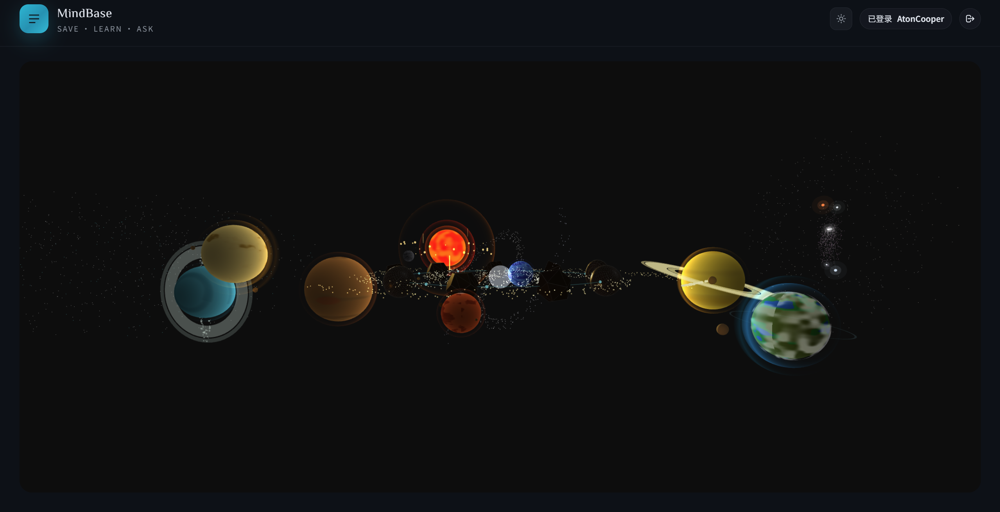
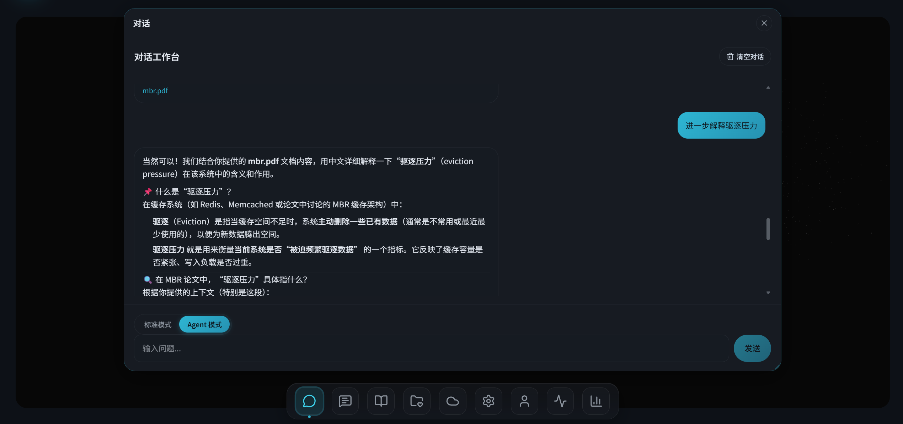
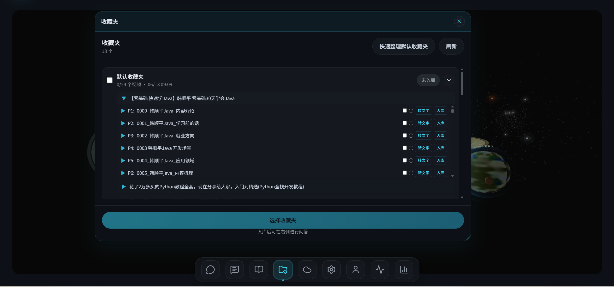
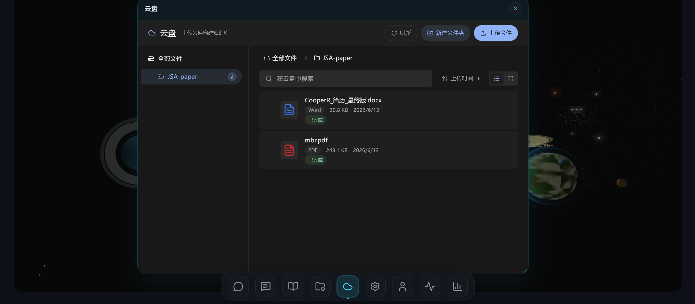
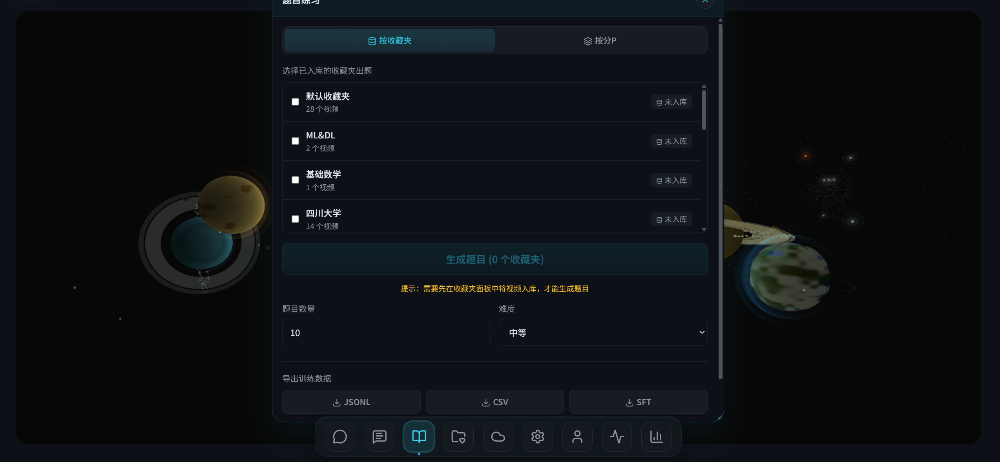
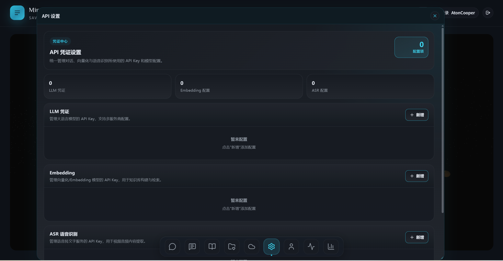
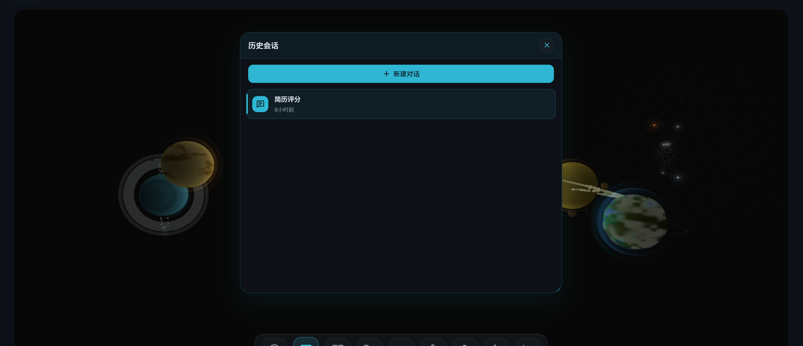
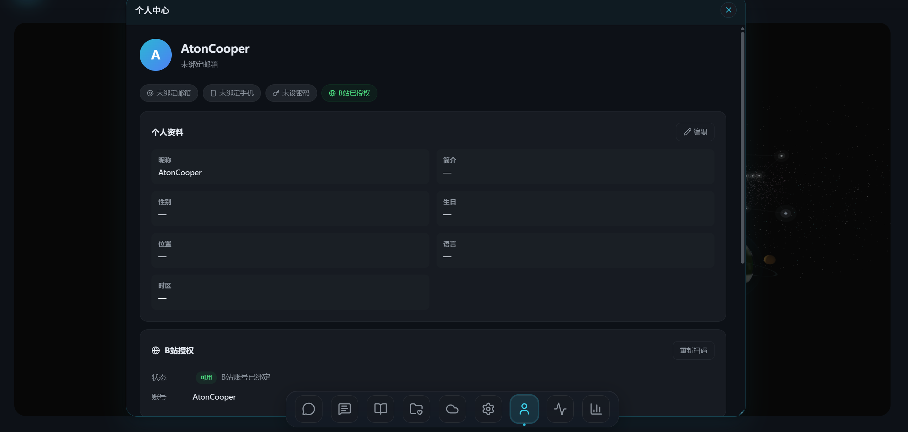

# MindBase Knowledge Base

把 B 站收藏、云盘文档和学习记录转化为可检索、可追问、可复习的个人知识库。

MindBase 面向“收藏了很多内容但很难重新利用”的场景：同步 B 站收藏夹，提取视频分 P 内容，写入向量库，再通过 Agentic Chat、语义检索、题目练习和历史会话把内容重新组织成可用知识。



## 核心能力

- **B 站收藏知识库**：扫码/账号登录后同步收藏夹，按收藏夹、视频、分 P 管理内容。
- **视频内容入库**：支持 ASR 内容查看、手动编辑、分 P 向量化、知识库构建进度追踪。
- **Agentic Chat**：默认使用 Agent ReAct 流式问答，结合收藏夹、工作区分 P、历史上下文和检索工具回答问题。
- **云盘知识库**：支持文件夹管理、文件上传、搜索、列表/网格视图、批量入库和实时处理状态。
- **题目练习**：可按收藏夹或已向量化分 P 生成练习题，支持提交批改、历史回看和训练数据导出。
- **多 Provider 配置**：前端管理 LLM、Embedding、ASR 凭证，支持默认配置、连接测试和用量统计。
- **Agent/Harness 工程化**：`AgentHarness` 统一管理工具发现、Agent 生命周期、运行时 metrics 和调度器。

## 最新界面预览

### Agentic Chat

默认聊天面板支持标准模式和 Agentic 模式，流式接收 SSE，展示来源、历史消息和知识库统计。



### 收藏夹与视频入库

收藏夹模块用于同步 B 站收藏、查看视频/分 P、触发 ASR 和向量化。



### 云盘知识库

云盘模块支持文件夹树、文件上传、批量处理、搜索、排序、详情抽屉和实时任务状态。



### 题目练习

Quiz 模块可基于收藏夹或已向量化分 P 生成练习题，并保留历史记录。



### API 设置

统一配置 LLM、Embedding 和 ASR Provider，支持新增、编辑、设为默认、测试连接。



### 历史与个人中心

支持历史会话管理、重命名/删除，以及个人资料、安全绑定、B 站授权状态维护。





## 架构概览

```text
Frontend / Next.js
  ├─ Dock + 3D 首页
  ├─ Chat / Favorites / Cloud Drive / Quiz / Settings
  └─ frontend/lib/api.ts 统一封装所有 API 调用

FastAPI Backend
  ├─ routers/*：HTTP 参数解析与响应转换
  ├─ services/*：业务编排、同步、ASR、RAG、Quiz、Cloud
  ├─ repository/*：数据库与向量存储访问
  ├─ agent/*：Chat / Memory / Quiz Agent 图
  ├─ harness/*：AgentRuntime、AgentHarness、调度与生命周期
  └─ tools/*：framework-agnostic tools，经 ToolManager 自动发现

Storage / Infra
  ├─ RDBMS：SQLite / MySQL
  ├─ Vector Store：Milvus
  ├─ MongoDB：聊天上下文/历史相关能力
  ├─ Redis：异步任务与缓存相关能力
  └─ MinIO：云盘文件存储
```

## 技术栈

### 前端

- Next.js 16 + React 19
- TypeScript
- Tailwind CSS 4
- Framer Motion
- Three.js / React Three Fiber
- Base UI / Radix UI / Lucide Icons
- Vitest

### 后端

- FastAPI
- SQLAlchemy Async
- LangChain / LangGraph
- OpenAI-compatible LLM 接入
- Milvus / PyMilvus
- MongoDB / Redis / MinIO
- pytest / pytest-asyncio

## 快速启动

### 1. 安装后端依赖

```bash
pip install -r requirements.txt
```

### 2. 配置环境变量

最小本地开发配置示例：

```bash
export LLM__API_KEY="你的 LLM Key"
export RDBMS__URL="sqlite+aiosqlite:///./data/mind_base.db"
```

如果使用 DashScope 兼容接口：

```bash
export DASHSCOPE_API_KEY="你的 DashScope Key"
export LLM__API_KEY="$DASHSCOPE_API_KEY"
```

配置加载顺序：

```text
app/config/default.yaml → app/config/config.yaml → app/config/local.yaml → 环境变量
```

环境变量采用双下划线映射，例如：

```bash
export RDBMS__URL="sqlite+aiosqlite:///./data/mind_base.db"
export LLM__MODEL="qwen-plus"
export MILVUS__ENABLED="true"
```

完整配置说明见：[`docs/configuration.md`](docs/configuration.md)。

### 3. 启动后端

```bash
uvicorn app.main:app --reload --port 8000
```

启动成功后访问：

- API 文档：`http://localhost:8000/docs`
- 健康检查：`http://localhost:8000/health`

### 4. 启动前端

```bash
cd frontend
npm install
npm run dev
```

默认访问：

```text
http://localhost:3000
```

如前端和后端不在同一 origin，设置：

```bash
export NEXT_PUBLIC_API_URL="http://localhost:8000"
export NEXT_PUBLIC_WS_URL="localhost:8000"
```

## Docker 启动

```bash
docker-compose up --build
```

适合一次性启动后端依赖、数据库、向量库和对象存储。实际连接参数以 `docker-compose.yml` 与 `app/config/config.yaml` 为准。

## 功能模块说明

### 对话

- 入口：Dock `对话`
- 前端：`frontend/components/ChatPanel.tsx`
- 后端：`app/routers/chat.py`、`app/services/chat/*`
- Agent：`app/agent/chat/*`
- Harness：`app/harness/*`

当前 Chat Router 是 HTTP 薄层，主要负责参数解析、依赖注入和 SSE 响应转换；聊天编排在 `app/services/chat/`，Agent 调用通过 `AgentHarness` 完成。

### 收藏夹

- 入口：Dock `收藏夹`
- 同步 B 站收藏夹与视频列表
- 支持分 P 查看、ASR 内容查看、向量化状态和知识库构建

### 云盘

- 入口：Dock `云盘`
- 支持文件夹树、上传、搜索、排序、批量处理、删除、详情抽屉
- 通过 WebSocket 接收云盘文件处理状态

### 题目练习

- 入口：Dock `题目练习`
- 支持按收藏夹或已向量化分 P 出题
- 支持提交批改、历史回看、错题/训练数据导出

### API 设置

- 入口：Dock `API 设置`
- 管理 LLM、Embedding、ASR 配置
- 支持多 Provider、多凭证、默认凭证和连接测试

### 任务监控与计费

- `任务监控` 查看异步任务状态
- `用量计费` 查看 token/API 调用统计和 Provider 分布

## 真实测试

### RAG 诊断

用于确认真实向量库和数据库状态：

```bash
python -m app.test.diagnose_rag
```

它会输出向量库文档数、搜索结果和 `VideoCache` 记录。

### Agent/Harness 真实集成测试

真实测试目录：

```text
app/test/real_agent_harness/
```

运行前必须显式打开开关，避免误把真实 LLM/向量库调用混入普通测试：

```bash
export BILIRAG_REAL_AGENT_HARNESS_TESTS=1
export LLM__API_KEY="你的真实 LLM Key"
pytest app/test/real_agent_harness -v -s
```

默认不设置开关时：

```bash
pytest app/test/real_agent_harness -q
```

预期结果为全部 skip，表示没有消耗真实资源。

更多说明见：

```text
app/test/real_agent_harness/README.md
```

### 前端测试

```bash
cd frontend
npm run lint
npm test
```

## 开发约束

- 前端所有请求必须通过 `frontend/lib/api.ts`，组件内不要直接 `fetch`。
- Router 层只做 HTTP 参数解析和响应转换，不写复杂业务逻辑。
- RAG/ASR/内容提取/向量库逻辑放在 service/repository 层，不要回灌到 router。
- 不要提交 `.env`、数据库文件、向量库数据、对象存储数据或真实密钥。
- 新增配置项时同步更新 `.env.example` 和相关文档。

## 目录索引

```text
app/
  agent/                 Agent 图与状态定义
  harness/               AgentHarness、AgentRuntime、调度与生命周期
  routers/               FastAPI 路由
  services/              业务服务
  repository/            数据访问与向量库实现
  tools/                 Agent 工具层
  test/                  后端测试与诊断脚本

frontend/
  app/                   Next.js App Router
  components/            UI 组件与 Dock 模块
  lib/api.ts             统一 API 客户端
  stores/                前端状态

assets/screenshots/      README 使用的最新界面截图
```
